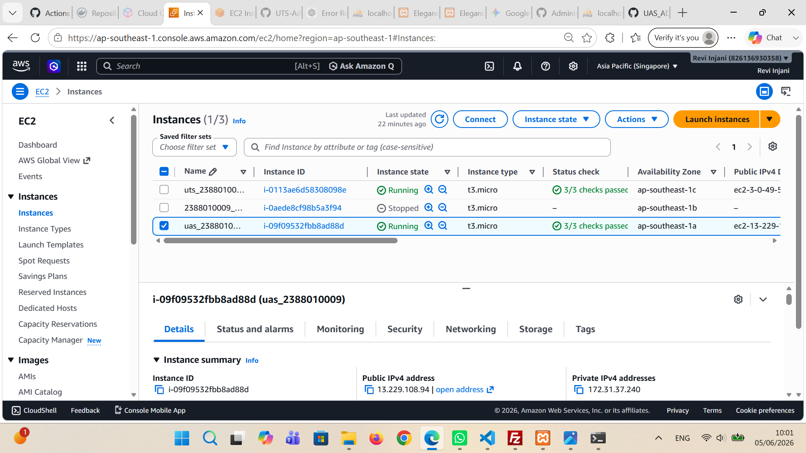
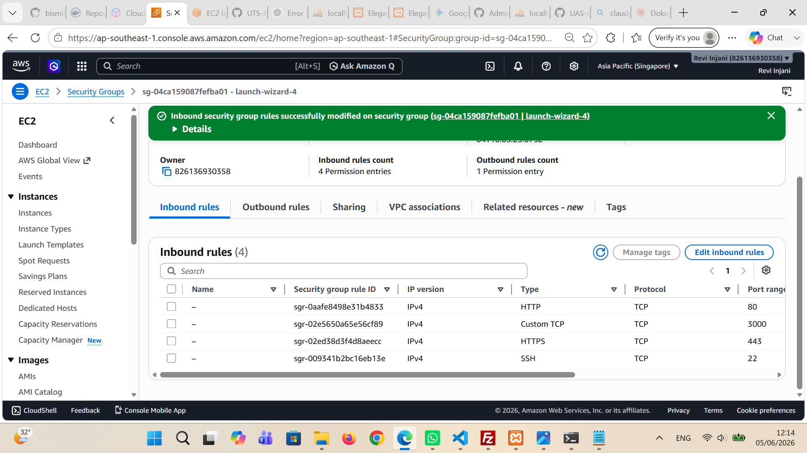
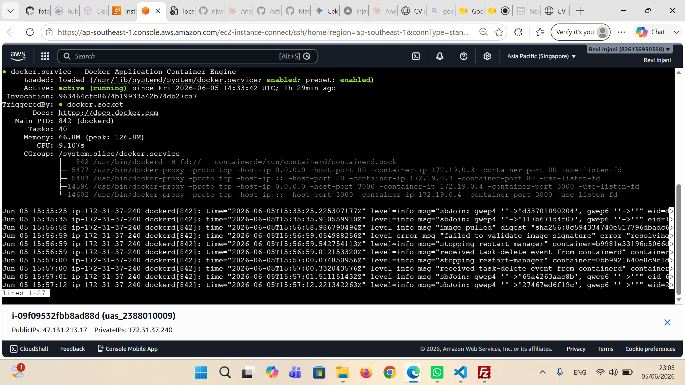
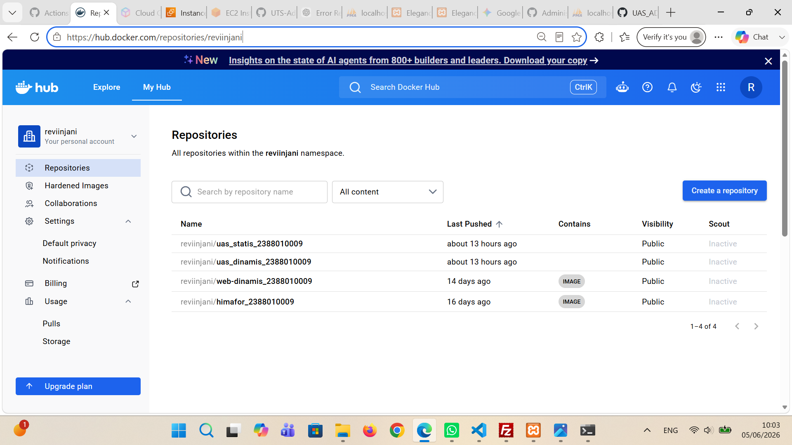
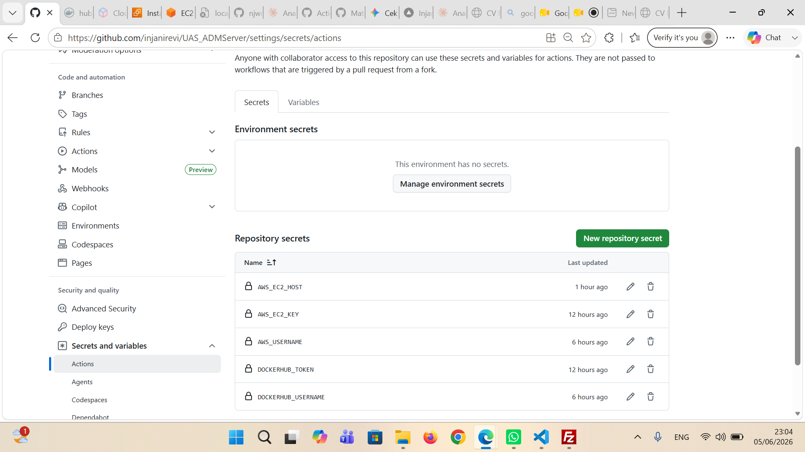
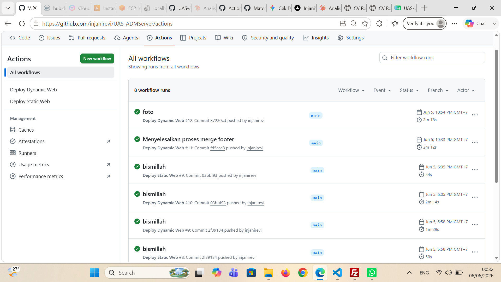
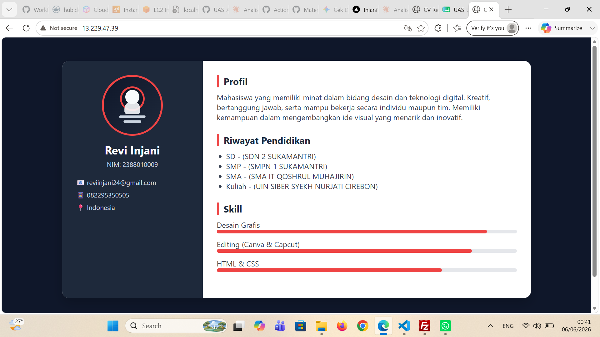
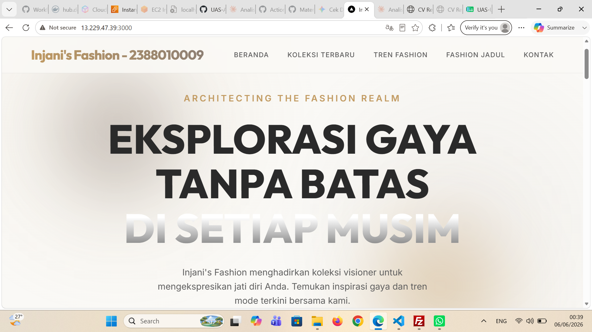
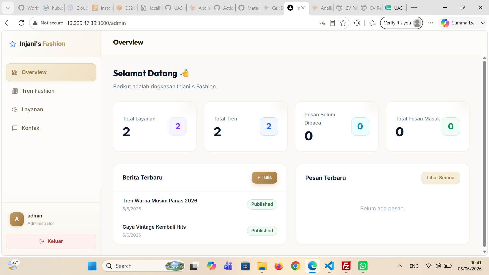

Laporan UAS: Deployment Aplikasi Web dengan Docker dan GitHub Actions
1. Membuat Instance Baru
- Membuat server baru di layanan cloud
- Simpan file key pair .pem untuk keperluan koneksi SSH

2. Menyimpan Key Pair .pem
- Download file .pem dari dashboard cloud
- Letakkan di folder yang aman untuk dipakai login ke server nantinya
3. Konfigurasi Firewall
- Buka port 80 untuk HTTP
- Buka port 3000 untuk aplikasi yang berjalan di port tersebut

4. Install Docker Engine
- Hapus paket Docker lama yang mungkin sudah terinstal
- Install docker-ce, docker-ce-cli, containerd.io, docker-buildx-plugin, dan docker-compose-plugin
- Cek status Docker untuk memastikan sudah berjalan.
Perintah yang digunakan:
sudo apt remove $(dpkg --get-selections docker.io docker-compose docker-compose-v2 docker-doc podman-docker containerd runc | cut -f1)
sudo apt install docker-ce docker-ce-cli containerd.io docker-buildx-plugin docker-compose-plugin
sudo systemctl status docker

5. Setup Docker Hub
- Buat access token di Docker Hub untuk autentikasi
- Buat repository baru bernama uas di Docker Hub

6. Konfigurasi GitHub Actions
- Tambahkan secret key di GitHub agar workflow bisa terhubung ke Docker Hub
- Isi variabel yang dibutuhkan untuk proses build dan deploy otomatis

7. Push dan verifikasi deployment
- Mengirimkan perubahan ke GitHub untuk menjalankan workflow GitHub Actions
- Memeriksa status deploy dan alamat IP publik aplikasi

8. Verifikasi tampilan web statis
- Disini mengecek halaman web statis setelah deploy

9. Verifikasi tampilan web dinamis
- Mengecek halaman web dinamis yang berjalan di server

10. Verifikasi halaman admin
- Mengecek halaman admin untuk memastikan akses backend berhasil
